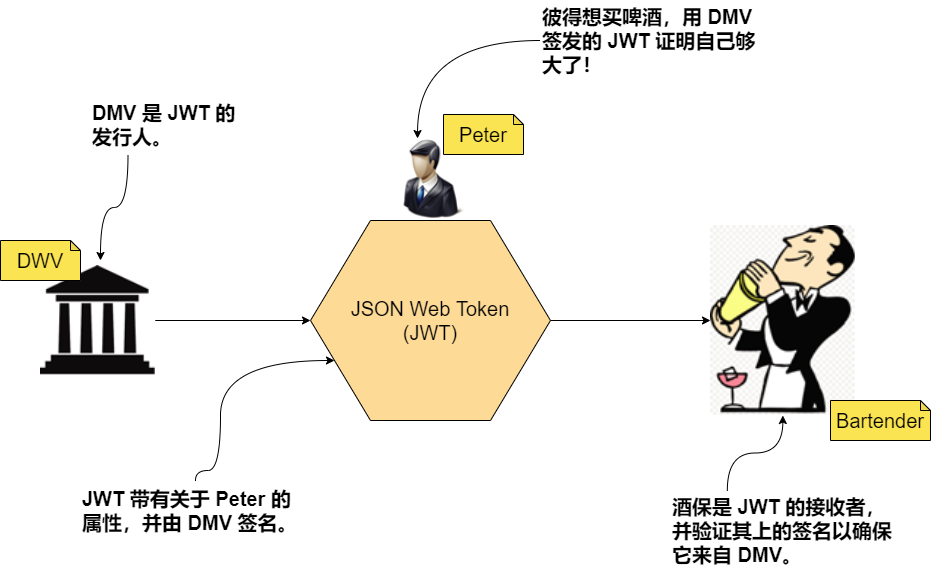
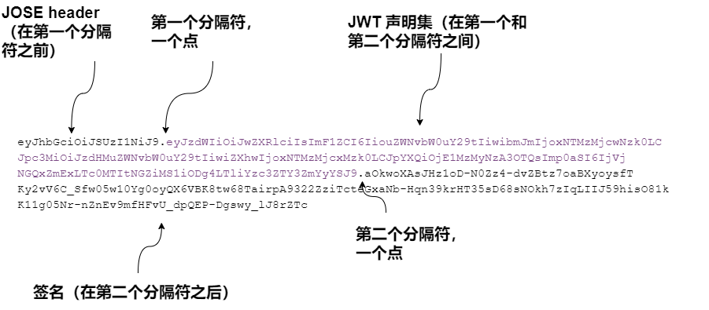
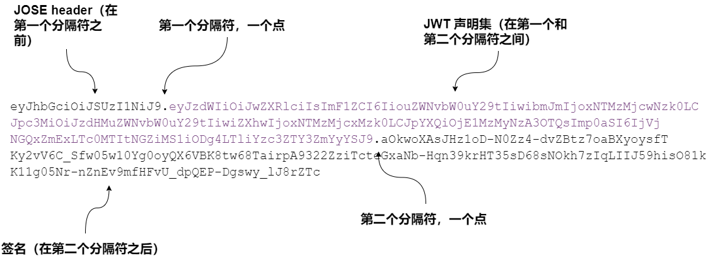
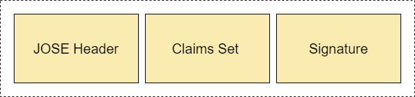
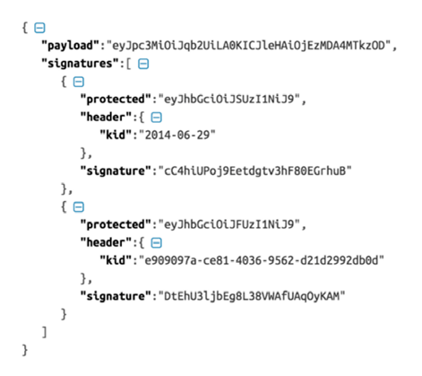
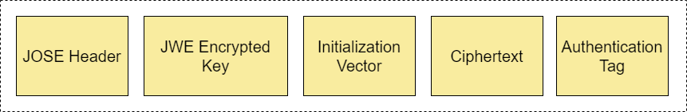
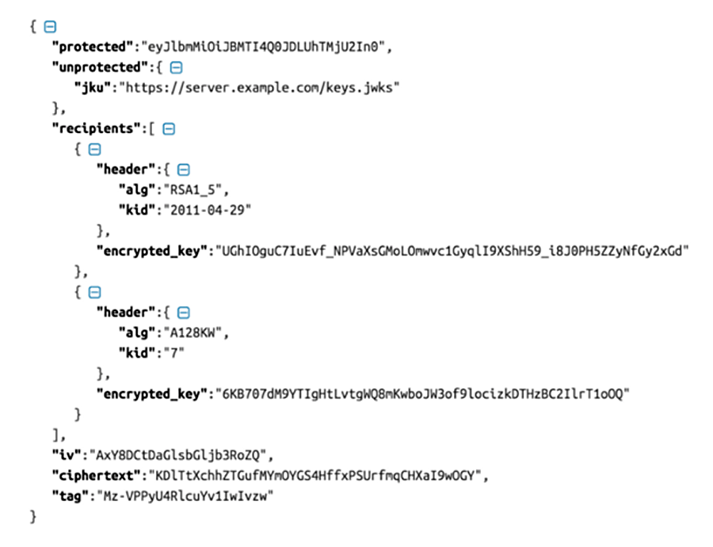

# JSON Web Token
:toc:


JWT 是确保微服务部署安全的重要组成部分。在本篇中，我们将详细讨论 JWT。
如果您有兴趣进一步了解 JWT 的内部结构，
我们推荐 Prabath Siriwardena（本书的合著者）的 Advanced API Security: OAuth 2.0 and Beyond（Apress，2019 年）和 YouTube 视频 JWT Internals and Applications  (www.youtube.com/watch?v=c-jsKk1OR24)，由 Prabath Siriwardena 提出。

## B.1 什么是 JSON Web Token？

JWT（读作 jot）是一种容器，它以加密安全的方式将不同类型的断言或声明从一个地方传送到另一个地方。
断言是实体发布的关于某人或某事的强烈声明。
该实体也称为断言的发布者。

想象一下，您所在省份的机动车辆管理局 (DMV) 可以使用您的个人信息创建 JWT（代表您的驾照），
其中包括您的姓名、地址、眼睛颜色、头发颜色、性别、出生日期、驾照到期日期，和许可证号码。
所有这些项目都是关于您的属性或声明，也称为属性断言。 DMV 是 JWT 的发行人。

任何获得此 JWT 的人都可以根据他们对令牌发行者（在本例中为 DMV）的信任程度来决定是否接受其中的内容。
但是在接受 JWT 之前，你怎么知道它是谁发布的？ JWT 的发行者使用发行者的私钥对其进行签名。
在图 B.1 所示的场景中，作为 JWT 接收者的调酒师可以验证 JWT 的签名并查看谁签署了它。

.图 B.1 JWT 用作容器，以加密安全的方式将声明从一个地方传输到另一个地方。酒保是 JWT 的接收者，只有在他们信任 JWT 的发行者 DMV 时才接受 JWT。


除了属性声明之外，JWT 还可以携带身份验证和授权声明。实际上，JWT 是一个容器；你可以用任何你需要的东西来填充它。
身份验证断言可能是用户的用户名以及发布者在发布声明之前如何对用户进行身份验证。
在 DMV 用例中，身份验证声明可能是您的名字和姓氏（甚至是您的驾照号码），或者 DMV 知道您的方式。

__授权声明__是关于用户的权利，或者用户可以做什么。根据 JWT 从发行者那里获得的声明，接收者可以决定如何行动。在 DMV 示例中，如果 DMV 决定将用户的年龄作为属性嵌入 JWT，那么该数据就是一个属性声明，调酒师可以通过数学计算来计算用户的年龄是否足以购买啤酒。此外，在不与调酒师分享用户年龄的情况下，DMV 可能会决定包含授权声明，说明用户的年龄足以购买啤酒。在这种情况下，调酒师将接受 JWT 并让用户购买啤酒。酒保不知道用户的年龄，但 DMV 授权用户购买啤酒。

除了携带一组关于用户的声明之外，JWT 在幕后还扮演着另一个角色。除了最终用户的身份外，JWT 还携带发行人的身份，在这种情况下是 DMV。发行人的身份隐含在 JWT 的签名中。通过在验证令牌签名的同时查看相应的公钥，接收者可以找出令牌发行者是谁。

## B.2 JWT 是什么样的？

在我们深入研究微服务部署中的 JWT 用例之前，请仔细研究一下 JWT。图 B.2 显示了 JWT 的最常见形式。这个数字可能看起来像胡言乱语，除非你的大脑被训练来解码 base64url 编码的字符串。

.图 B.2 一个 base64url 编码的 JWT，它也是一个 JWS


您在图 B.2 中看到的是 JSON Web Signature (JWS)，我们将在第 B.3 节中详细讨论。 JWS 是 JWT 最常用的格式，由三个部分组成，每个部分之间用点 (.) 分隔：

* 第一部分称为  _JSON Object Signing and Encryption (JOSE) header_。
* 第二部分是 _claims set_，或 _body_（或 _payload_）。
* 第三部分是 _signature_。


JOSE header 是一个 base64url 编码的 JSON 对象，它表示与 JWT 相关的元数据，例如用于对消息进行签名的算法。这是 base64url 解码的 JOSE header：
```json
{
  "alg": "RS256",
}
```

JWT 声明集是一个 base64url 编码的 JSON 对象，它携带声明（在第一个和第二个分隔符之间）。以下是 base64url 解码的声明集：

```json
{
  "sub": "peter",
  "aud": "*.ecomm.com",
  "nbf": 1533270794,
  "iss": "sts.ecomm.com",
  "exp": 1533271394,
  "iat": 1533270794,
  "jti": "5c4d1fa1-7412-4fb1-b888-9bc77e67ff2a"
}
```

JWT 规范 (RFC 7519) 定义了七个属性：`sub`、`aud`、`nbf`、`iss`、`exp`、`iat` 和 `jti`。这些都不是强制性的——由依赖 JWT 的其他规范来定义什么是强制性的，什么是可选的。例如，OpenID Connect 规范强制要求 `iss` 属性。 JWT 规范定义的这七个属性已在 Internet 编号分配机构 (IANA) Web 令牌声明注册表中注册。但是，您可以将自己的自定义属性引入 JWT 声明集。在以下部分中，我们将详细讨论这七个属性。


### B.2.1 JWT 的 issuer

JWT 声明集中的 `iss` 属性携带与 JWT 的发布者或断言方对应的标识符。 JWT 由发行人的私钥签名。在给定信任域内的典型微服务部署中，所有微服务都信任一个发行者，该发行者通常称为安全令牌服务 (STS)。


### B.2.2 JWT 的主体

JWT 声明集中的 `sub` 属性定义了 JWT 的主体。__主体__是 JWT 的所有者——或者换句话说，JWT 带有关于主体的声明。 JWT 的应用可以进一步细化子属性的定义。例如，OpenID Connect 规范规定 `sub` 属性是强制性的，令牌的发行者必须确保 sub 属性带有唯一标识符。

### B.2.3 JWT 的受众

JWT 声明集中的 `aud` 属性指定令牌的受众或预期接收者。在图 B.2 中，它被设置为字符串值 `*.ecomm.com`。 `aud` 属性的值可以是微服务或 JWT 接收者已知的任何字符串或 URI。

每个微服务在接受任何 JWT 为有效之前都必须检查 `aud` 参数的值以查看它是否已知。例如，如果您有一个名为 `foo` 且受众值为 `foo.ecomm.com` 的微服务，则该微服务应拒绝任何携带 `aud` 值 `bar.ecomm.com` 的 JWT。基于受众接受或拒绝 JWT 的逻辑取决于相应的微服务和整体微服务安全设计。例如，通过设计，您可以定义一个策略来同意任何微服务都将接受具有受众值 `<microservice identifier>.ecomm.com` 或 `*.ecomm.com` 的令牌。

### B.2.4 JWT 过期时间，不早于发布时间

JWT 声明集中的 `exp` 属性值表示以秒为单位的过期时间，它是从 `1970-01-01T0:0:0Z` 计算得出的，以协调世界时 (UTC) 衡量。 JWT 的任何接收者都必须确保在接受 JWT 时 `exp` 属性表示的时间不是过去的——或者换句话说，令牌没有过期。 JWT 声明集中的 `iat` 属性表示 JWT 的发布时间。这也以秒为单位表示，并根据以 UTC 衡量的 `1970-01-01T0:0:0Z` 计算得出。

当声明集中存在 `nbf`（不是之前）属性时，`iat` 和 `exp` 之间的时间差（以秒为单位）不是 JWT 的生命周期。在 `nbf` 属性中指定的时间之前，您不应开始处理 JWT（或将其作为有效令牌接受）。 `nbf` 的值也以秒为单位表示，从 1970-01-01T0:0:0Z 开始计算，以 UTC 为单位测量。当声明集中存在 `nbf` 属性时，JWT 的生命周期计算为 `exp` 和 `nbf` 属性之间的差异。但是，在大多数情况下，`nbf` 的值等于 `iat` 的值。

### B.2.5 JWT 标识符

JWT 声明集中的 `jti` 属性定义了令牌的唯一标识符。理想情况下，令牌发行者不应发行具有相同 `jti` 的两个 JWT。但是，如果 JWT 的接收者接受来自多个发行者的令牌，则给定的 `jti` 将仅与相应的发行者标识符一起是唯一的。

## B.3 JSON Web Signature

B.2 节中解释的 JWT（以及，作为提醒，如图 B.3 所示）也是一个 JSON Web 签名。 JWS 是一种表示签名消息的方式。此消息可以是任何内容，例如 JSON 有效负载、XML 有效负载或二进制文件。

.图 B.3 Base64url 编码的 JWT，也是一个 JWS


JWS 可以以两种格式序列化，或以两种方式表示：紧凑序列化和 JSON 序列化。我们不会将每个 JWS 都称为 JWT。只有在遵循紧凑序列化并携带 JSON 对象作为有效负载时，JWS 才会成为 JWT。在 JWT 术语下，我们将此有效负载称为声明集。图 B.4 显示了一个紧凑序列化的 JWS——或 JWT。 B.3 节详细说明了图 B.4 中每个组件的含义。

.图 B.4 JWT 是一个紧凑序列化的 JWS，带有 JOSE header、声明集和签名


通过 JSON 序列化，JWS 表示为 JSON 负载（见图 B.5）。它不称为 JWT。 JSON 序列化 JWS 中的 payload 参数可以携带任何值。图 B.5 中被签名和表示的消息是一个带有所有相关元数据的 JSON 消息。

.图 B.5 包含相关元数据的带有 JSON 序列化的 JWS


与 JWT 不同，JSON 序列化的 JWS 可以携带对应于相同负载的多个签名。在图 B.5 中，`signatures` JSON 数组带有两个元素，每个元素带有相同负载的不同 `signature`。 `signatures` JSON 数组的每个元素中的 `protected` 和 `header` 属性定义了与相应签名相关的元数据。

让我们看看如何使用开源 Nimbus（https://connect2id.com/products/nimbus-jose-jwt）Java 库来创建 JWS。与本附录中使用的所有示例相关的源代码可在 https://github.com/microservices-security-in-action/samples GitHub 存储库的 appendix-b 目录中找到。

NOTE: 在运行本附录中的示例之前，请确保您已经下载并安装了 2.1.1 节中提到的所有必需软件。

让我们构建构建 JWS 的示例并运行它。从 appendix-b/sample01 目录运行以下 Maven 命令。第一次运行此命令时，可能需要几分钟才能完成构建过程。如果一切顺利，您应该会在最后看到 `BUILD SUCCESS` 消息：

```bash
mvn clean install
```

输出::
```
[INFO] BUILD SUCCESS
```

现在运行您的 Java 程序以使用以下命令（来自 appendix-b/sample01/lib 目录）创建 JWS。如果它执行成功，它会打印 base64url-encoded JWS：

[source,bash]
----
java -cp "../target/com.manning.mss.appendixb.sample01-1.0.0.jar:*" \
com.manning.mss.appendixb.sample01.RSASHA256JWTBuilder
----

```
eyJhbGciOiJSUzI1NiJ9.eyJzdWIiOiJwZXRlciIsImF1ZCI6IiouZWNvbW0uY29tIiwibmJmIj
oxNTMzMjcwNzk0LCJpc3MiOiJzdHMuZWNvbW0uY29tIiwiZXhwIjoxNTMzMjcxMzk0LCJpYXQiO
jE1MzMyNzA3OTQsImp0aSI6IjVjNGQxZmExLTc0MTItNGZiMS1iODg4LTliYzc3ZTY3ZmYyYSJ9
.aOkwoXAsJHz1oD-N0Zz4-dvZBtz7oaBXyoysfTKy2vV6C_Sfw05w10Yg0oyQX6VBK8tw68Tair
pA9322ZziTcteGxaNb-Hqn39krHT35sD68sNOkh7zIqLIIJ59hisO81kK11g05Nr-nZnEv9mfHF
vU_dpQEP-Dgswy_lJ8rZTc
```
您可以使用 https://jwt.io 上提供的 JWT 解码器来解码此 JWS。以下是解码后的 JWS 声明集或负载：

[source,json]
----
{
  "sub": "peter",
  "aud": "*.ecomm.com",
  "nbf": 1533270794,
  "iss": "sts.ecomm.com",
  "exp": 1533271394,
  "iat": 1533270794,
  "jti": "5c4d1fa1-7412-4fb1-b888-9bc77e67ff2a"
}
----

NOTE: 如果您在执行上一条命令时遇到任何错误，请检查您是否从正确的位置执行了该命令。它必须来自 appendix-b/sample01/lib 目录，而不是来自 appendix-b/sample01 目录。还要确保 `–cp` 参数的值在双引号内。


查看生成 JWT 的代码。它带有注释，直截了当，一目了然。您可以在 sample01/src/main/java/com/manning/mss/appendixb/sample01/RSASHA256JWTBuilder.java 文件中找到完整的源代码。

下面的方法完成了 JWT 生成的核心工作。它接受令牌发行者的私钥作为输入参数，并使用它通过 RSA-SHA256 对 JWT 进行签名。

.清单 B.1 RSASHA256JWTBuilder.java 文件
```java
public static String buildRsaSha256SignedJWT(PrivateKey privateKey) throws JOSEException {
    // build audience restriction list.
    List<String> aud = new ArrayList<String>();
    aud.add("*.ecomm.com");
    Date currentTime = new Date();

    // create a claims set.
    JWTClaimsSet jwtClaims = new JWTClaimsSet.Builder().

    // set the value of the issuer.
    issuer("sts.ecomm.com").

    // set the subject value - JWT belongs to this subject.
    subject("peter").

    // set values for audience restriction.
    audience(aud).

    // expiration time set to 10 minutes.
    expirationTime(new Date(new Date().getTime() + 1000 * 60 * 10)).

    // set the valid from time to current time.
    notBeforeTime(currentTime).

    // set issued time to current time.
    issueTime(currentTime).

    // set a generated UUID as the JWT identifier.
    jwtID(UUID.randomUUID().toString()).build();

    // create JWS header with RSA-SHA256 algorithm.
    JWSHeader jswHeader = new JWSHeader(JWSAlgorithm.RS256);

    // create signer with the RSA private key..
    JWSSigner signer = new RSASSASigner((RSAPrivateKey) privateKey);

    // create the signed JWT with the JWS header and the JWT body.
    SignedJWT signedJWT = new SignedJWT(jswHeader, jwtClaims);

    // sign the JWT with HMAC-SHA256.
    signedJWT.sign(signer);

    // serialize into base64url-encoded text.
    String jwtInText = signedJWT.serialize();

    // print the value of the JWT.
    System.out.println(jwtInText);
    return jwtInText;
}
```

## B.4 JSON Web Encryption


在上一节中，我们说过 JWT 是一个紧凑序列化的 JWS。它也是一种紧凑序列化的 JSON Web 加密 (JWE)。与 JWS 一样，JWE 表示使用紧凑序列化或 JSON 序列化的加密消息。仅当使用紧凑序列化时，JWE 才称为 JWT。换句话说，JWT 可以是 JWS 或 JWE，后者是紧凑序列化的。 JWS 解决其中包含的数据的完整性和不可否认性方面，而 JWE 保护数据的机密性。

一个紧凑序列化的 JWE（见图 B.6）有五个部分；每个部分都是 base64urlencoded 并用点 (.) 分隔。 JOSE header 是 JWE 的一部分，它携带与加密相关的元数据。 JWE 加密密钥、初始化向量和认证标签与加密期间执行的密码操作有关。我们不会在这里详细讨论这些。如果您有兴趣，我们推荐博客 “JWT、JWS 和 JWE for Not So Dummies”，网址为 http://mng.bz/gya8 。 最后，JWE 的密文部分包括加密文本。

.图 B.6 JWT 是一个紧凑序列化的 JWE


通过 JSON 序列化，JWE 表示为 JSON 有效负载。它不称为 JWT。 JSON 序列化的 JWE 中的密文属性携带任何有效载荷的加密值，可以是 JSON、XML 甚至二进制。实际有效载荷被加密并在图 B.7 中表示为带有所有相关元数据的 JSON 消息。

.图 B.7 带有 JSON 序列化和所有相关元数据的 JWE


让我们看看如何使用开源 Nimbus Java 库来创建 JWE。与本附录中使用的所有示例相关的源代码可在 https://github.com/microservices-security-in-action/samples Git 存储库的 appendix-b 目录中找到。在深入研究用于构建 JWE 的 Java 代码之前，请尝试构建示例并运行它。从 appendix-b/sample02 目录运行以下 Maven 命令。如果一切顺利，您应该会在最后看到 `BUILD SUCCESS` 消息：

```bash
 mvn clean install
```

输出::
```
[INFO] BUILD SUCCESS
```

现在运行您的 Java 程序以使用以下命令（来自 appendix-b/sample02/lib 目录）创建 JWE。如果它执行成功，它会打印 base64urlencoded JWE：

[source,bash]
----
java -cp "../target/com.manning.mss.appendixb.sample02-1.0.0.jar:*" \
com.manning.mss.appendixb.sample02.RSAOAEPJWTBuilder
----

输出::

[source]
----
eyJlbmMiOiJBMTI4R0NNIiwiYWxnIjoiUlNBLU9BRVAifQ.Cd0KjNwSbq5OPxcJQ1ESValmRGPf
7BFUNpqZFfKTCd-9XAmVE-zOTsnv78SikTOK8fuwszHDnz2eONUahbg8eR9oxDi9kmXaHeKXyZ9
Kq4vhg7WJPJXSUonwGxcibgECJySEJxZaTmA1E_8pUaiU6k5UHvxPUDtE0pnN5XD82cs.0b4jWQ
HFbBaM_azM.XmwvMBzrLcNW-oBhAfMozJlmESfG6o96WT958BOyfjpGmmbdJdIjirjCBTUATdOP
kLg6-YmPsitaFm7pFAUdsHkm4_KlZrE5HuP43VM0gBXSe-41dDDNs7D2nZ5QFpeoYH7zQNocCjy
bseJPFPYEw311nBRfjzNoDEzvKMsxhgCZNLTv-tpKh6mKIXXYxdxVoBcIXN90UUYi.mVLD4t-85
qcTiY8q3J-kmg
----

以下是解密后的 JWE 负载：

[source]
----
JWE Header:{"enc":"A128GCM","alg":"RSA-OAEP"}
JWE Content Encryption Key: Cd0KjNwSbq5OPxcJQ1ESValmRGPf7BFUNpqZFfKTCd-9
XAmVE-zOTsnv78SikTOK8fuwszHDnz2eONUahbg8eR9oxDi9kmXaHeKXyZ9Kq4vhg7WJPJXS
UonwGxcibgECJySEJxZaTmA1E_8pUaiU6k5UHvxPUDtE0pnN5XD82cs
Initialization Vector: 0b4jWQHFbBaM_azM
Ciphertext: XmwvMBzrLcNW-oBhAfMozJlmESfG6o96WT958BOyfjpGmmbdJdIjirjCBTUA
TdOPkLg6-YmPsitaFm7pFAUdsHkm4_KlZrE5HuP43VM0gBXSe-41dDDNs7D2nZ5QFpeoYH7z
QNocCjybseJPFPYEw311nBRfjzNoDEzvKMsxhgCZNLTv-tpKh6mKIXXYxdxVoBcIXN90UUYi
Authentication Tag: mVLD4t-85qcTiY8q3J-kmg
Decrypted Payload:
{
     "sub":"peter",
     "aud":"*.ecomm.com",
     "nbf":1533273878,
     "iss":"sts.ecomm.com",
     "exp":1533274478,
     "iat":1533273878,
     "jti":"17dc2461-d87a-42c9-9546-e42a23d1e4d5"
}
----

NOTE: 如果您在执行上一条命令时遇到任何错误，请检查您是否从正确的位置执行了该命令。它必须来自 appendix-b/sample02/lib 目录，而不是来自 appendix-b/sample02 目录。还要确保 –cp 参数的值在双引号内。

现在看一下生成 JWE 的代码。代码注释简单明了，一目了然。您可以在 sample02/src/main/java/com/manning/mss/appendixb/sample02/RSAOAEPJWT Builder.java 文件中找到完整的源代码。以下清单中的方法完成了 JWE 加密的核心工作。它接受令牌接收者公钥作为输入参数，并使用它通过 RSA-OAEP 加密 JWE。

.清单 B.2 RSAOAEPJWTBuilder.java 文件
[source,java]
----
public static String buildEncryptedJWT(PublicKey publicKey) throws JOSEException {
    // build audience restriction list.
    List<String> aud = new ArrayList<String>();
    aud.add("*.ecomm.com");
    Date currentTime = new Date();

    // create a claims set.
    JWTClaimsSet jwtClaims = new JWTClaimsSet.Builder().

    // set the value of the issuer.
    issuer("sts.ecomm.com").

    // set the subject value - JWT belongs to this subject.
    subject("peter").

    // set values for audience restriction.
    audience(aud).

    // expiration time set to 10 minutes.
    expirationTime(new Date(new Date().getTime() + 1000 * 60 * 10)).

    // set the valid from time to current time.
    notBeforeTime(currentTime).

    // set issued time to current time.
    issueTime(currentTime).

    // set a generated UUID as the JWT identifier.
    jwtID(UUID.randomUUID().toString()).build();

    // create JWE header with RSA-OAEP and AES/GCM.
    JWEHeader jweHeader = new JWEHeader(JWEAlgorithm.RSA_OAEP,
    EncryptionMethod.A128GCM);

    // create encrypter with the RSA public key.
    JWEEncrypter encrypter = new RSAEncrypter((RSAPublicKey) publicKey);

    // create the encrypted JWT with the JWE header and the JWT payload.
    EncryptedJWT encryptedJWT = new EncryptedJWT(jweHeader, jwtClaims);

    // encrypt the JWT.
    encryptedJWT.encrypt(encrypter);

    // serialize into base64url-encoded text.
    String jwtInText = encryptedJWT.serialize();

    // print the value of the JWT.
    System.out.println(jwtInText);
    return jwtInText;
}
----
