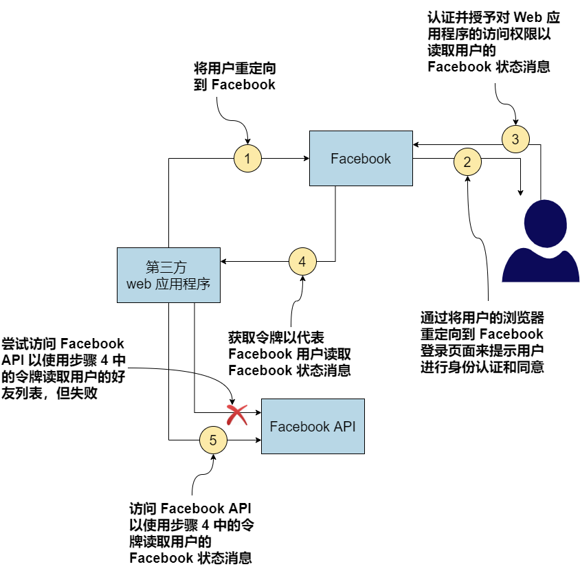
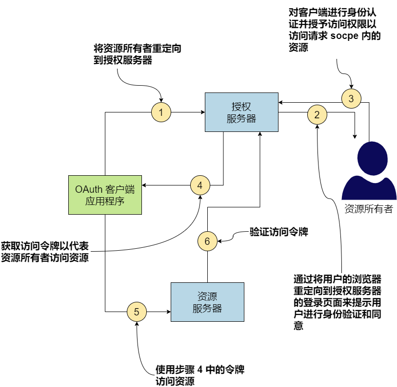
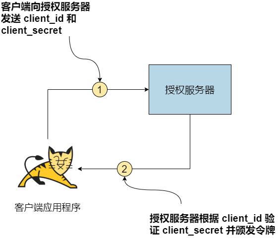
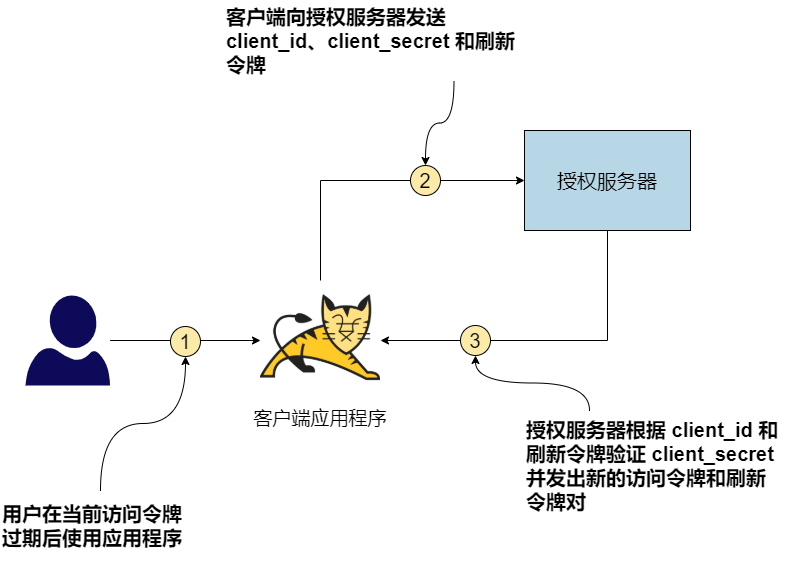
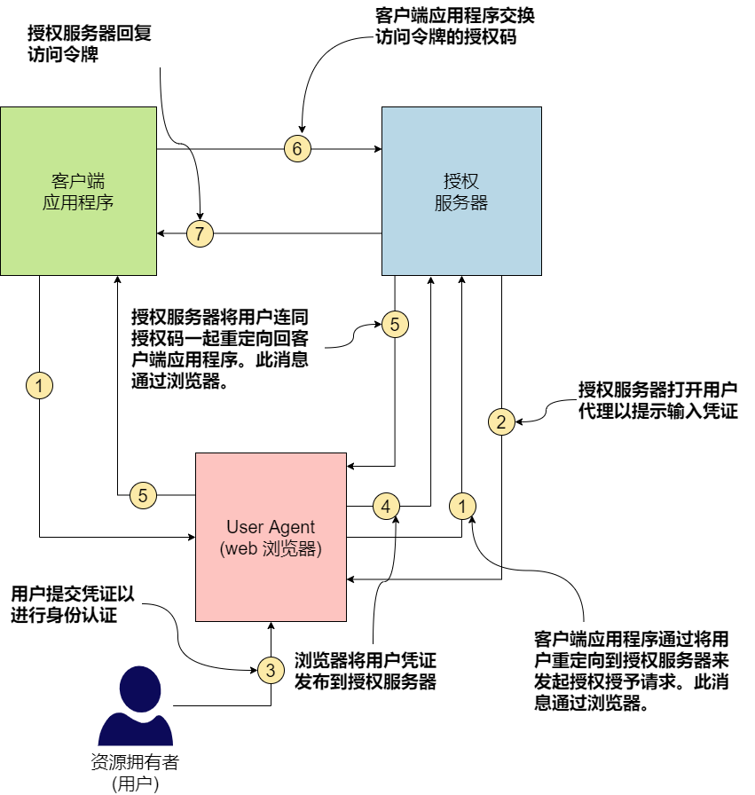
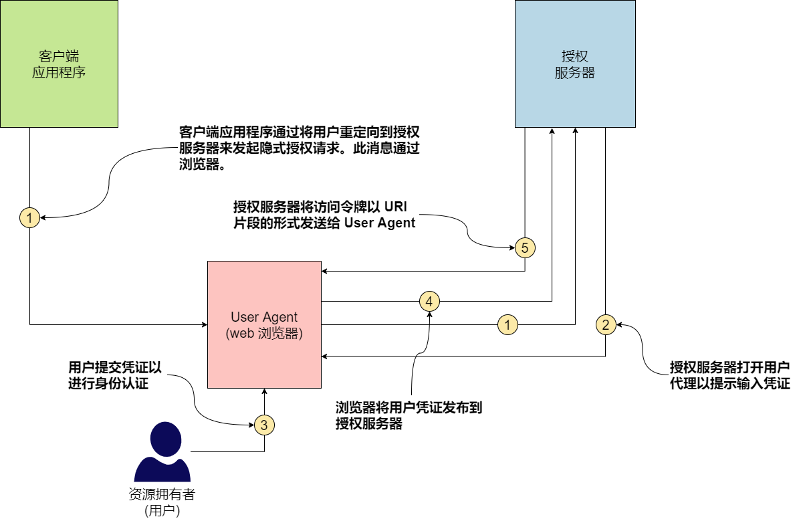
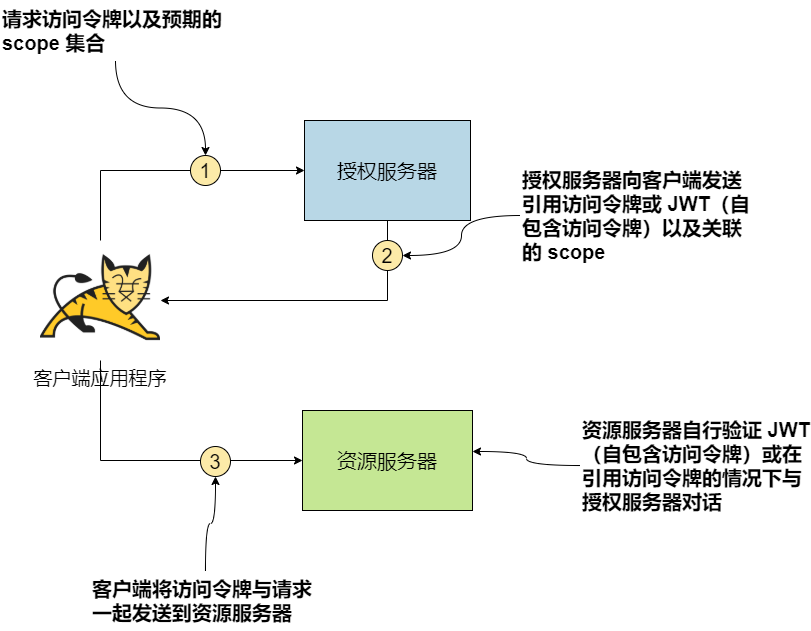

:toc:

*_OAuth 2.0_* 是由互联网工程任务组 (IETF) OAuth 工作组开发的授权框架。它在 RFC 6749 中定义。 OAuth 2.0 的基本重点是解决访问委托问题。 OpenID Connect (OIDC) 是建立在 OAuth 2.0 之上的身份层，OpenID Foundation 开发了 OpenID Connect 规范。

如果您有兴趣详细了解 OAuth 2.0 和 API 安全性，我们推荐 Prabath Siriwardena（本书的合著者）的 Advanced API Security: OAuth 2.0 and Beyond（Apress，2019 年）。 Justin Richer 和 Antonio Sanso 的 OAuth 2 in Action（Manning，2017 年）也是一个很好的参考。


## A.1 访问委托问题

如果您希望其他人代表您访问资源（微服务、API 等）并对该资源执行某些操作，您需要将相应的访问权限委托给该人（或事物）。例如，如果您希望第三方应用程序读取您的 Facebook 状态消息，则需要授予该第三方应用程序访问 Facebook API 的相应权限。访问委托有两种模型：

* 通过凭证共享访问委派
* 无凭据共享的访问委派

如果我们遵循第一个模型，我们需要与第三方应用程序共享我们的 Facebook 凭据，以便它可以使用 Facebook API、使用我们的凭据进行身份验证并读取我们的 Facebook 状态消息。这是一个非常危险的模型（我们仅以 Facebook 为例；但是，它不支持此模型）。

一旦您与第三方应用程序共享您的凭据，它就可以做任何事情，而不仅仅是读取您的 Facebook 状态消息。它可以阅读您的朋友列表、查看您的照片以及通过 Messenger 与您的朋友聊天。这是 OAuth 之前许多应用程序使用的模型。 FlickrAuth、Google AuthSub 和 Yahoo BBAuth 都试图以他们自己的专有方式解决这个问题：在没有凭证共享的情况下进行访问委托。 2007 年发布的 OAuth 1.0 是第一个以标准方式破解这个问题的尝试。 OAuth 2.0 遵循 OAuth 1.0 设定的方向，并于 2012 年 10 月成为 RFC 6749。

## A.2 OAuth 2.0 如何解决访问委托问题？

OAuth 1.0 和 OAuth 2.0 在概念上都以相同的方式解决了访问委托问题。主要区别在于 OAuth 2.0 比 OAuth 1.0 更具可扩展性。 OAuth 1.0 是一个具体的协议，而 OAuth 2.0 是一个授权框架。在附录的其余部分，当我们说 OAuth 时，我们指的是 OAuth 2.0。

图 A.1 说明了一个请求/响应流程，其中第三方 Web 应用程序遵循访问委托，使用__无凭据共享模型__来访问 Facebook API。

使用 OAuth 2.0，第三方 Web 应用程序首先将用户重定向到 Facebook（用户所属的位置）。 Facebook 验证并获得用户同意与第三方 Web 应用程序共享临时令牌，该令牌仅足以在有限的时间内读取用户的 Facebook 状态消息。一旦 Web 应用程序从 Facebook 获取令牌，它就会使用该令牌以及对 Facebook 的 API 调用。

Facebook 发行的临时令牌具有有限的生命周期，并且与 Facebook 用户、第三方 Web 应用程序和用途绑定。此处令牌的目的是读取用户的 Facebook 状态消息，令牌应该仅能做到这一点，仅此而已。 OAuth 2.0 术语如下：

* Facebook 用户称为__资源所有者__。资源所有者决定谁应该对该资源所有者拥有的资源具有哪个级别的访问权限。
* 发布令牌的 Facebook 称为__授权服务器__。授权服务器知道如何验证（或识别）资源所有者，并授予第三方应用程序访问权限以访问资源所有者拥有的资源，并征得他们的同意。
* Facebook API 称为__资源服务器__。资源服务器保护资源所有者拥有的资源，只有在访问请求带有授权服务器颁发的有效令牌时才允许某人访问资源。
* 第三方 Web 应用程序称为__客户端__。客户端代表资源所有者使用资源。
+
.图 A.1 第三方应用程序遵循访问委托模型，不共享凭据，以从 Facebook 获取临时令牌，该令牌仅足以读取用户的状态消息。

* Facebook 向第三方 Web 应用程序颁发的令牌称为__访问令牌__。授权服务器发布访问令牌，资源服务器验证这些。为了验证访问令牌，资源服务器可以与授权服务器通信。
* 令牌的用途称为 _scope_。资源服务器确保给定的令牌只能用于附加到它的作用域。如果第三方应用程序尝试使用读取状态消息的访问令牌写入用户的 Facebook 墙，该请求将失败。
* 第三方 Web 应用程序获取令牌时发生的事件流称为 _grant flow_，由 *grant type* 定义。 OAuth 2.0 定义了一组授权类型，我们将在第 A.4 节中讨论。

在附录的其余部分，我们将详细讨论 OAuth 2.0 概念。

## A.3 OAuth 2.0 流程的参与者

在 OAuth 2.0 中，我们主要讨论四个参与者，基于每个参与者在访问委托流程中扮演的角色（见图 A.2）。我们在 A.2 节中简要讨论了它们：

* 资源服务器
* 客户端
* 最终用户(也被称为资源所有者)
* 授权服务器

在典型的访问委托流程中，客户端使用授权服务器提供的令牌代表最终用户（或资源所有者）访问托管在资源服务器上的资源。此令牌授予客户端代表最终用户访问资源的访问权限。

.图 A.2 在典型的 OAuth 2.0 访问委托流程中，客户端代表最终用户使用授权服务器提供的令牌访问托管在资源服务器上的资源。


### A.3.1 资源服务器的作用

__资源服务器__托管资源，并根据特定条件决定谁可以访问哪些资源。如果我们以著名的图像和视频托管服务 Flickr 为例，您上传到 Flickr 的所有图像和视频都是资源。因为 Flickr 承载所有这些，所以 Flickr 是资源服务器。在我们在 A.2 部分讨论的 Facebook 示例中，托管 Facebook API 的服务器是资源服务器。 Facebook 墙、好友列表、视频和照片是 Facebook API 暴露的资源。

在微服务部署中，我们可以将微服务（例如，您在本书前面开发和测试的订单处理微服务）视为资源服务器，将订单视为资源。订单处理微服务是负责管理订单的实体。此外，您可以考虑将所有微服务公开给外部客户端应用程序的 API 网关作为资源服务器。正如我们在第 5 章中讨论的那样，API 网关针对其托管的所有 API 集中实现节流和访问控制策略。

### A.3.2 客户端应用程序的作用

__客户端__是资源的消费者。如果我们扩展在 A.3.1 节中讨论的同一个 Flickr 示例，一个想要访问您的 Flickr 照片的 Web 应用程序就是一个客户端。它可以是任何类型的应用程序：移动应用程序、Web 应用程序，甚至是桌面应用程序。在我们在 A.2 节讨论的 Facebook 示例中，想要读取 Facebook 状态消息的第三方应用程序也是一个客户端应用程序。

在微服务部署中，您从中使用订单处理微服务的应用程序是客户端应用程序。客户端应用程序是 OAuth 流程中的实体，它寻求最终用户的批准以代表他们访问资源。

### A.3.3 资源拥有者的作用

资源拥有者（或最终用户）是资源的所有者。在我们的 Flickr 示例中，您是拥有您的 Flickr 照片的资源拥有者（或最终用户）。在我们在 A.2 部分讨论的 Facebook 示例中，Facebook 用户是资源拥有者。

在微服务部署中，通过客户端应用程序（在内部与订单处理微服务对话）下订单的人是最终用户。在某些情况下，客户端应用程序本身可以是最终用户，它只是访问微服务，就像它自己一样，没有其他方参与。

### A.3.4 授权服务器的作用

在 OAuth 2.0 环境中，__授权服务器__发布令牌（通常称为__访问令牌__）。 OAuth 2.0 令牌是授权服务器颁发给客户端应用程序以代表最终用户访问资源（例如，微服务或 API）的密钥。资源服务器与授权服务器对话以验证随访问请求而来的令牌。在颁发访问令牌之前，授权服务器应该知道如何对最终用户进行身份验证，以及如何验证客户端应用程序的身份。

## A.4 授权类型

在本节中，我们将讨论 OAuth 2.0 授权类型，并向您展示如何为您的应用程序选择正确的授权类型。因为本书是关于微服务的，所以我们将讨论重点放在这些上，但请记住，OAuth 2.0 不仅仅是关于微服务。

具有不同特征的不同类型的应用程序可以使用您的微服务。应用程序获取访问令牌以代表用户访问资源的方式取决于这些应用程序特征。客户端应用程序选择请求/响应流程以从授权服务器获取访问令牌，这在 OAuth 2.0 中称为__授权类型__。

标准的 OAuth 2.0 规范确定了五种主要的授权类型。每种授权类型都概述了获取访问令牌的步骤。执行特定授权类型的结果是一个访问令牌，可用于访问微服务上的资源。以下是 OAuth 2.0 规范中突出显示的五种主要授权类型：

* _客户端凭证(Client credentials)_ — 适用于没有最终用户的两个系统之间的身份认证（我们在第 A.4.1 节中讨论）
* _资源拥有者密码(Resource owner password)_ — 适用于受信任的应用程序（我们在第 A.4.2 节中讨论了这一点）
* _授权码(Authorization code)_ —  适用于几乎所有具有最终用户的应用程序（我们在第 A.4.4 节中讨论）
* _隐式(Implicit)_ — 不要使用它！ （我们在 A.4.5 节讨论这个）
* _刷新令牌(Refresh token)_ — 用于更新过期的访问令牌（我们在 A.4.3 节讨论这个）

OAuth 2.0 框架不限于这五种授权类型。这是一个可扩展的框架，允许您根据需要添加授权类型。以下是核心规范中未定义但在相关配置文件中的另外两种流行的授权类型：

* _SAML Profile for OAuth 2.0 Client Authentication and Authorization Grants_ — 适用于使用 SAML 2.0（在 RFC 7522 中定义）的单点登录应用程序
* _JWT Profile for OAuth 2.0 Client Authentication and Authorization Grants_ — 适用于使用 OpenID Connect（在 RFC 7523 中定义）进行单点登录的应用程序

### A.4.1  客户端凭证授权类型

对于 _Client credentials 授权类型_，我们在授权流程中只有两个参与者：客户端应用程序和授权服务器。没有单独的资源所有者；客户端应用程序本身是资源所有者。

每个客户端都携带自己的凭证，称为 _client ID_ 和 _client secret_，由授权服务器颁发给它。 `client ID` 是客户端应用程序的标识符； `client secret` 是客户端的密码。客户端应用程序应该安全地存储和使用 client secret。例如，您永远不应该以明文形式存储 client secret；相反，对其进行加密并将其存储在持久存储（例如数据库）中。

如图 A.3 所示，在客户端凭证授权类型中，客户端应用程序必须通过 HTTPS 将其 `client ID` 和 `client secret` 发送到授权服务器以获取访问令牌。授权服务器验证 ID 和 secret 的组合并使用访问令牌进行响应。

.图 A.3 客户端凭证授权类型允许应用程序在没有最终用户的情况下获取访问令牌；应用程序本身就是最终用户。


这是用于客户端凭证授权请求的示例 `curl` 命令（这只是示例，因此不要按原样尝试）：

```bash
curl \
-u application_id:application_secret \
-H "Content-Type: application/x-www-form-urlencoded" \
-d "grant_type=client_credentials" https://localhost:8085/oauth/token
```

在这种情况下，值 `application_id` 是 client ID，值 `application_secret` 是客户端应用程序的 client secret。 `-u` 参数指示 `curl` 对字符串 `application_id:application_secret` 执行 base64 编码操作。作为 HTTP 授权 header 发送到授权服务器的结果字符串将是 `YXBwbGljYXRpb25faWQ6YXBwbGljYXRpb25fc2VjcmV0`。授权服务器验证此请求并在以下 HTTP 响应中发出访问令牌：

```json
{
  "access_token":"de09bec4-a821-40c8-863a-104dddb30204",
  "token_type":"bearer",
  "expires_in":3599
}
```

即使我们在 `curl` 命令中使用 `client secret` (`application_secret`) 向授权服务器的令牌端点验证客户端应用程序，如果需要更强的身份验证，客户端应用程序也可以使用 mTLS。在这种情况下，我们需要在客户端应用端有一个公钥/私钥对，并且授权服务器必须信任公钥或证书的颁发者。

客户端凭证授权类型适用于访问 API 且无需担心最终用户的应用程序。简而言之，当您不需要担心访问委托时，或者换句话说，客户端应用程序仅通过自己而不是代表其他任何人访问 API 时，这很好。因此，当应用程序、周期性任务或任何类型的系统直接希望通过 OAuth 2.0 访问您的微服务时，客户端凭证授权类型主要用于系统到系统的身份认证。

让我们以天气微服务为例。它提供未来五天的天气预报。如果您构建一个 Web 应用程序来访问天气微服务，您可以简单地使用客户端凭证授权类型，因为天气微服务对了解谁使用您的应用程序不感兴趣。它只关心访问它的应用程序，而不是最终用户。

### A.4.2 资源拥有者密码授权类型

__资源拥有者密码授权类型__是客户端凭证授权类型的扩展，但它增加了对使用用户用户名和密码进行资源拥有者身份认证的支持。这种授权类型涉及 OAuth 2.0 流程中的所有四方——资源拥有者（最终用户）、客户端应用程序、资源服务器和授权服务器。

资源拥有者向客户端应用程序提供他们的**用户名**和**密码**。客户端应用程序使用此信息向授权服务器发出令牌请求，以及嵌入在自身中的 client ID 和 client secret。图 A.4 说明了资源拥有者密码授权类型。

.图 A.4 密码授权类型允许应用程序获取访问令牌。


以下是向授权服务器发出密码授权请求的示例 `curl` 命令（这只是一个示例，所以不要按原样尝试）：

[source,bash]
----
curl \
-u application_id:application_secret \
-H "Content-Type: application/x-www-form-urlencoded" \
-d "grant_type=password&username=user&password=pass" \
https://localhost:8085/oauth/token
----

与客户端凭证授权一样，`application_id` 和 `application_secret` 在 HTTP Authorization header 中以 base64 编码形式发送。请求正文包含授权类型字符串、用户的用户名和用户的密码。请注意，由于您在请求 header 和请求中以纯文本格式传递敏感信息，因此必须通过 TLS (HTTPS) 进行通信。否则，任何进入网络的入侵者都将能够看到正在传递的值。

在这种情况下，授权服务器不仅验证客户端 ID 和 secret（application_id 和 application_secret）以验证客户端应用程序，还验证用户的凭证。只有当所有四个字段都有效时，才会发行令牌。与客户端凭证授权类型一样，在成功进行身份认证后，授权服务器会使用有效的访问令牌进行响应，如下所示：

[source,json]
----
{
  "access_token":"de09bec4-a821-40c8-863a-104dddb30204",
  "refresh_token":" heasdcu8-as3t-hdf67-vadt5-asdgahr7j3ty3",
  "token_type":"bearer",
  "expires_in":3599
}
----

您在响应中找到的 `refresh_token` 参数的值可用于在当前访问令牌到期之前对其进行更新。 （我们在 A.6 节讨论刷新令牌。）您可能已经注意到，我们没有在客户端凭证授权类型中获得 `refresh_token`。

对于密码授权类型，资源拥有者（应用程序的用户）需要向客户端应用程序提供他们的用户名和密码。因此，此授权类型应仅用于授权服务器信任的客户端应用程序。这种访问委托模型称为__具有凭证共享的访问委托__。事实上，这是 OAuth 2.0 想要避免使用的。那为什么会出现在 OAuth 2.0 规范中呢？在 OAuth 2.0 规范中引入密码授权类型的唯一原因是帮助使用 HTTP 基本身份认证的遗留应用程序迁移到 OAuth 2.0；否则，您应该尽可能避免使用密码授权类型。

与客户端凭证授权类型一样，密码授权类型要求应用程序安全地存储 client secret。负责任地处理用户凭证也非常重要。理想情况下，客户端应用程序不得在本地存储最终用户的密码，只使用它从授权服务器获取访问令牌，然后忘记它。客户端应用程序在密码授权流程结束时获得的访问令牌具有有限的生命周期。在此令牌到期之前，客户端应用程序可以使用从授权服务器的令牌响应中收到的 `refresh_token` 获取新令牌。这样，每次应用程序上的令牌过期时，客户端应用程序都不必提示用户输入用户名和密码。

### A.4.3 刷新令牌授权类型

__刷新令牌授权__用于更新现有访问令牌。通常，它在当前访问令牌到期或即将到期时使用，并且应用程序需要新的访问令牌才能使用，而无需提示应用程序用户再次登录。要使用刷新令牌授权，应用程序应在令牌响应中接收访问令牌和刷新令牌。

并非每个授权类型都会与其访问令牌一起发布刷新令牌，包括客户端凭证授权和隐式授权（稍后在第 A.4.5 节中讨论）。因此，刷新令牌授权类型是一种特殊的授权类型，只能与使用其他授权类型来获取访问令牌的应用程序一起使用。图 A.5 说明了刷新令牌授权流程。

.图 A.5 刷新令牌授权类型允许在令牌到期时续期。


以下 `curl` 命令可用于通过刷新令牌授权更新访问令牌（这只是一个示例，因此不要按原样尝试）：
```bash
curl \
-u application_id:application_secret \
-H "Content-Type: application/x-www-form-urlencoded" \
-d "grant_type=refresh_token&refresh_token=heasdcu8-as3t-hdf67-vadt5-asdgahr7j3ty3" \
https://localhost:8085/oauth/token
```

与前面的情况一样，应用程序的 client ID 和 client secret（application_id 和 application_secret）必须以 base64 编码格式作为 HTTP 授权标头发送。您还需要在请求负载（请求体）中发送刷新令牌的值。因此，刷新令牌授权应仅用于可以安全地存储 client secret 和刷新令牌值的应用程序，而没有任何妥协的风险。

刷新令牌的生命周期通常是有限的，但它通常比访问令牌的生命周期长得多，因此即使在很长一段时间处于空闲状态后，应用程序也可以更新其令牌。当您刷新响应中的访问令牌时，授权服务器会发送更新的访问令牌以及另一个刷新令牌。此刷新令牌可能与您在来自授权服务器的第一个请求中获得的刷新令牌相同，也可能不同。这取决于授权服务器；它不受 OAuth 2.0 规范的约束。

### A.4.4 授权码授权类型

__授权码授权__用于桌面应用程序和 Web 应用程序（通过 Web 浏览器访问）或能够处理 HTTP 重定向的本机移动应用程序。在授权码授权流程中，客户端应用首先向授权服务器发起授权码请求。此请求提供应用程序的 client ID 和重定向 URL，以在身份认证成功时重定向用户。图 A.6 说明了授权码授权的流程。

.图 A.6 授权码授权类型允许客户端应用程序代表最终用户（或资源拥有者）获取访问令牌。


如图 A.6 所示，客户端应用程序的第一步是发起授权码请求。获取授权码的 HTTP 请求如下所示（这只是一个示例，所以不要按原样尝试）：

```bash
GET https://localhost:8085/oauth/authorize?
 response_type=code&
 client_id=application_id&
 redirect_uri=https%3A%2F%2Fweb.application.domain%2Flogin
```

可以看到，请求中携带了 `client_id`(application_id)、`redirect_uri` 和 `response_type` 参数。 `response_type` 向授权服务器指示预期授权码作为对该请求的响应。此授权代码在所提供的 `redirect_uri` 上的 HTTP 重定向 (https://developer.mozilla.org/en-US/docs/Web/HTTP/Redirections) 中作为查询参数提供。 `redirect_uri` 是授权服务器在成功验证后应将浏览器（用户代理）重定向到的位置。

在 HTTP 中，当服务器发送 300 到 310 之间的响应代码时会发生重定向。在这种情况下，响应代码将为 302。响应将包含一个名为 `Location` 的 HTTP header 和 `Location` header 的值将带有浏览器应重定向到的 URL。示例 `Location` header 如下所示：
```properties
Location: https://web.application.domain/login?code=hus83nn-8ujq6-7snuelq
```

`redirect_uri` 应该等于在授权服务器上注册特定客户端应用程序时提供的 `redirect_uri`。 `Location` 响应头中的 URL（host）应该等于 HTTP 请求中的 `redirect_uri` 查询参数，用于启动授权授权流程。本示例中授权请求中未包含的一个可选参数是 `scope`。在发出授权请求时，应用程序可以请求它在要颁发的令牌上所需的 scope。我们在 A.5 节中详细讨论了 scope。

授权服务器收到这个授权请求后，首先验证 `client ID` 和 `redirect_uri`；如果这些参数有效，它会向用户显示授权服务器的登录页面（假设授权服务器上没有运行有效的用户会话）。用户需要在此登录页面上输入其用户名和密码。验证用户名和密码后，授权服务器颁发授权码并通过 HTTP 重定向将其提供给 user agent。授权码是 `redirect_uri` 的一部分，如下所示：

`https://web.application.domain/login?code=hus83nn-8ujq6-7snuelq`

因为授权码是通过 `redirect_uri` 提供给 user agent 的，所以它必须通过 HTTPS 传递。另外，因为这是浏览器重定向，授权码的值对最终用户是可见的，也可能会登录到服务器日志中。为了降低这些数据被泄露的风险，授权码的生命周期通常很短（不超过 30 秒）并且是一次性使用的 code。如果 code 被多次使用，授权服务器会撤销之前针对它颁发的所有令牌。

收到授权码后，客户端应用程序向授权服务器颁发令牌请求，请求访问令牌以换取授权码。以下是此请求的 `curl` 命令（图 A.6 中的步骤 6）：

```bash
 curl \
-u application1:application1secret \
-H "Content-Type: application/x-www-form-urlencoded" \
-d "grant_type=authorization_code&code=hus83nn-8ujq6-7snuelq&redirect_uri=https%3A%2F%2Fweb.application.domain%2Flogin" \
https://localhost:8085/oauth/token
```

与目前讨论的其他授权类型一样，授权码授权类型要求以 base64 编码格式将 client ID 和 client secret（可选）作为 HTTP 授权 header 发送。它还需要将 `grant_type` 参数作为 `authorization_code` 发送；code 本身的值和 `redirect_uri` 在 HTTP 请求的有效负载中发送到授权服务器的令牌端点。验证这些详细信息后，授权服务器会在 HTTP 响应中向客户端应用程序发出访问令牌：

```json
{
  "access_token":"de09bec4-a821-40c8-863a-104dddb30204",
  "refresh_token":" heasdcu8-as3t-hdf67-vadt5-asdgahr7j3ty3",
  "token_type":"bearer",
  "expires_in":3599
}
```

在返回授权码之前（图 A.6 中的步骤 5），授权服务器通过验证用户的用户名和密码来验证用户。在图 A.6 的步骤 6 中，授权服务器通过验证应用程序的客户端 ID 和 secret 来验证客户端应用程序。授权码授权类型不强制要求对应用程序进行身份认证。因此，不必在对令牌端点的请求中使用应用程序 secret 来交换访问令牌的授权码。这是我们在第 4 章中讨论的 SPA 中使用授权码授予类型时推荐的方法。

如您所见，授权码授权涉及用户、客户端应用程序和授权服务器。与密码授权不同，这种授权类型不需要用户向客户端应用程序提供他们的凭证。用户仅在授权服务器的登录页面上提供其凭证。这样，您可以防止客户端应用程序了解用户的登录凭证。因此，此授权类型适合为您不完全信任的 Web、移动和桌面应用程序提供用户凭证。

使用此授权类型的客户端应用程序需要具备一些先决条件才能安全地使用此协议。因为应用程序需要知道和处理敏感信息，例如 client secret、刷新令牌和授权码，所以它需要能够谨慎地存储和使用这些值。它需要具有在存储和使用 HTTPS 时加密 client secret 和刷新令牌的机制，例如，与授权服务器进行安全通信。客户端应用程序和授权服务器之间的通信需要通过 TLS 进行，这样网络入侵者就看不到正在交换的信息。

### A.4.5 隐式授权类型

__隐式授权类型__类似于授权码授权类型，但它不涉及在获取访问令牌之前获取授权码的中间步骤。相反，授权服务器直接发布访问令牌以响应隐式授权请求。图 A.7 说明了隐式授权流程。

.图 A.7 隐式授权类型允许客户端应用程序获取访问令牌。


对于隐式授权类型，当用户尝试登录应用程序时，客户端应用程序通过创建隐式授权请求来启动登录流程。此请求应包含 client ID 和 `redirect_uri`。与授权码授权类型一样，`redirect_uri` 被授权服务器用于在身份认证成功时将用户代理重定向回客户端应用程序。以下是一个示例隐式授权请求（这只是一个示例，所以不要按原样尝试）：

```bash
GET https://localhost:8085/oauth/authorize?
 response_type=token&
 client_id=application_id&
 redirect_uri=https%3A%2F%2Fweb.application.domain%2Flogin
```

正如您在 HTTPS 请求中看到的，授权码授权的初始请求与隐式授权的初始请求之间的区别在于，本例中的 `response_type` 参数是 `token`。这向授权服务器表明您有兴趣获取访问令牌作为对隐式请求的响应。与授权码授权一样，这里的 `scope` 也是一个可选参数，用户代理可以提供它来要求授权服务器发出具有所需作用域的令牌。

当授权服务器收到此请求时，它会验证 client ID 和 `redirect_uri`，如果它们有效，则向用户显示授权服务器的登录页面（假设浏览器上没有针对授权服务器运行的活动用户会话） ）。当用户输入他们的凭证时，授权服务器会验证它们并向用户呈现一个同意页面，以确认应用程序能够执行由 `scope` 参数表示的操作（仅当请求中提供了 scope 时）。请注意，用户在授权服务器的登录页面上提供凭证，因此只有授权服务器才能知道用户的凭证。当用户同意所需的 scope 时，授权服务器发出访问令牌并将其作为 URI 片段提供给 `redirect_uri` 本身上的用户代理。以下是此类重定向的示例：

`https://web.application.domain/login#access_token=jauej28slah2&expires_in=3599`

当用户代理（Web 浏览器）收到此重定向时，它会向 `web.application.domain/login` URL 发出 HTTPS 请求。由于 `access_token` 字段是作为 URI 片段提供的（由 URL 中的 # 字符表示），因此该特定值不会提交到 `web.application.domain` 上的服务器。只有颁发令牌的授权服务器和用户代理（Web 浏览器）才能知道访问令牌的值。隐式授权不向用户代理提供刷新令牌。正如我们在本章前面讨论的那样，因为访问令牌的值是在 URL 中传递的，所以它会在浏览器历史记录中，也可能会登录到服务器日志中。

隐式授权类型不需要您的客户端应用程序维护任何敏感信息，例如 client secret 或刷新令牌。这一事实使其非常适合用于 SPA，其中通过 JavaScript 在 Web 浏览器上呈现内容。这些类型的应用程序主要在客户端（浏览器）执行；因此，这些应用程序无法处理敏感信息，例如 client secret。但是，使用隐式授权类型的安全问题远高于其好处，因此不再推荐使用，即使对于 SPA 也是如此。如上一节所述，建议使用没有 client secret 的授权码授权类型，即使对于 SPA 也是如此。

## A.5 scope 将功能绑定到 OAuth 2.0 访问令牌

授权服务器发出的每个访问令牌都与一个或多个 scope 相关联。_scope_ 定义了令牌的用途。一个令牌可以有多个用途；因此，它可以与多个 scope 相关联。scope 定义了客户端应用程序可以使用相应的令牌在资源服务器上执行的操作。

当客户端应用程序从授权服务器请求令牌时，连同令牌请求，它还指定它期望从令牌获得的 scope（见图 A.8）。这并不一定意味着授权服务器必须尊重该请求并发布具有所有请求 scope 的令牌。授权服务器可以自行决定，也可以征得资源拥有者的同意，决定与访问令牌关联的 scope。在令牌响应中，它将与令牌关联的 scope 连同令牌一起发送回客户端应用程序。

.图 A.8 客户端应用程序请求访问令牌以及预期的 scope 集合。当访问令牌是自包含的 JWT 时，资源服务器会自行验证令牌，而无需与授权服务器会话。


## A.6 自包含的访问令牌

访问令牌可以是参考令牌或自包含令牌。参考令牌只是一个字符串，只有令牌的发行者知道如何验证它。当资源服务器获得参考令牌时，它必须一直与授权服务器通信以验证令牌。

相反，如果令牌是自包含令牌，则资源服务器可以自行验证令牌；无需与授权服务器对话（见图 A.8）。自包含令牌是签名的 JWT 或 JWS（参见附录 B）。在 IETF OAuth 工作组下开发的 OAuth 2.0 访问令牌的 JWT 配置文件（在撰写本文时处于第五稿），定义了自包含访问令牌的结构。

## A.7 什么是 OpenID Connect？

_OpenID Connect_ 建立在 OAuth 2.0 之上，作为附加的身份层。它使用 ID 令牌的概念。 ID 令牌是包含经过身份认证的用户信息的 JWT，包括用户声明和其他相关属性。当授权服务器发出 ID 令牌时，它会使用其私钥对 JWT 的内容进行签名（已签名的 JWT 称为 JWS 或 _JSON Web Signature_）。在任何应用程序接受 ID 令牌为有效之前，它应该通过验证 JWT 的签名来验证其内容。

NOTE: 应用程序使用 ID 令牌来获取信息，例如用户的用户名、电子邮件地址、电话号码等。访问令牌是应用程序用来代表最终用户访问安全 API 或仅通过其本身访问安全 API 的凭证。 OAuth 2.0 仅提供访问令牌，而 OpenID Connect 提供访问令牌和 ID 令牌。

以下是包含 OpenID Connect 规范 (http://mng.bz/yyWo) 定义的标准声明的解码 ID 令牌示例（仅限有效负载）：

```json
{
  "iss":"http://server.example.com",
  "sub":"janedoe@example.xom",
  "aud":"8ajduw82swiw",
  "nonce":"82jd27djuw72jduw92ksury",
  "exp":1311281970,
  "iat":1311280970,
  "auth_time":1539339705,
  "acr":"urn:mace:incommon:iap:silver",
  "amr":"password",
  "azp":"8ajduw82swiw"
}
```

这些属性的详细信息在 OIDC 规范中。下面列出了一些重要的：

* _iss_ — ID 令牌颁发者的标识符（通常是表示颁发 ID 令牌的授权服务器的标识符）。
* _sub_ — 为其颁发令牌的令牌的主题（通常是在授权服务器上aud—进行身份验证的用户）。
* _aud_ — token 的受众；应该将令牌用于特定目的的实体标识符的集合。它必须包含客户端应用程序的 OAuth 2.0 `client_id`，以及零个或多个其他标识符（数组）。如果特定客户端应用程序使用 ID 令牌，则应验证它是否是 ID 令牌的预期受众之一；客户端应用程序的 `client_id` 应该是 aud 声明中的值之一。
* _iat_ — 颁发 ID 令牌的时间。
* _exp_ — ID 令牌到期的时间。仅当  exp 声明晚于当前时间戳时，应用程序才必须使用 ID 令牌。

ID 令牌通常作为访问令牌响应的一部分获得。正如我们在第 A.5 节中所讨论的，OAuth 2.0 提供者支持用于获取访问令牌的各种授权类型。 ID 令牌通常通过使用授权类型在对访问令牌请求的响应中发送。您需要在令牌请求中指定 `openid` 作为作用域，以通知授权服务器您需要在响应中使用 ID 令牌。以下是使用 `authorization_code` 授权类型时如何在授权请求中请求 ID 令牌的示例：

```bash
GET https://localhost:8085/oauth/authorize?
 response_type=code&
 scope=openid&
 client_id=application1&
 redirect_uri=https%3A%2F%2Fweb.application.domain%2Flogin
```

ID 令牌以以下形式在令牌请求的响应中发送：
```json
{
  "access_token": "sdfj82j7sjej27djwterh720fnwqudkdnw72itjswnrlvod92hvkwyfp",
  "expires_in": 3600,
  "token_type": "Bearer",
  "id_token": "sdu283ngk23rmas….."
}
```

`id_token` 是一个 JWT，它由三个 base64 URL 编码的字符串构建，每个字符串用句点分隔。为了便于阅读，我们在示例中省略了完整的字符串。在第 3 章中，您将看到如何在 SPA 的实践中使用 OpenID Connect。

## A.8 有关 OpenID Connect 和 OAuth 2.0 的更多信息

如果您有兴趣了解有关 OpenID Connect 和 OAuth 2.0 的更多信息，以下列表提供了由 Prabath Siriwardena（本书的合著者）提供的一组 YouTube 视频：

* _OAuth 2.0 with curl (www.youtube.com/watch?v=xipHJSW93KI)_ — 本视频将带您了解所有核心 OAuth 2.0 授权类型，使用 curl 作为客户端应用程序。
* _OAuth 2.0 Access Token versus OpenID Connect ID Token (www.youtube.com/watch?v=sICt5aS7wzk)_ — 该视频解释了 OAuth 2.0 访问令牌和 OpenID Connect ID 令牌之间的区别。
* _OAuth 2.0 Response Type versus Grant Type (www.youtube.com/watch?v=Qdjuavr33E4)_ — 该视频解释了您在 OAuth 2.0 流程中找到的 `response_type` 参数和 `grant_type` 参数之间的区别。
* _OAuth 2.0 Token Introspection (www.youtube.com/watch?v=CuawoBrs_6k)_ — 该视频介绍了 OAuth 2.0 令牌自省 RFC，资源服务器使用它与授权服务器对话以验证访问令牌。
* _OAuth 2.0 Token Revocation (www.youtube.com/watch?v=OEab8UoEUow)_ — 该视频介绍了 OAuth 2.0 令牌撤销 RFC，客户端应用程序使用它来撤销访问令牌。
* *Proof Key for Code Exchange (www.youtube.com/watch?v=2pJShFKYoJc)* — 该视频介绍了 code 交换 RFC 的证明密钥，它可以帮助您保护您的应用程序免受代码拦截攻击。
* _Securing Single-Page Applications with OpenID Connect (www.youtube.com/watch?v=tmKD2famPJc)_ — 该视频解释了 OpenID Connect 的内部结构以及如何使用 OpenID Connect 来保护 SPA。