# Mermaid 图形

## Flowchart


### 基础语法

**默认节点**

```
flowchart LR
    id
```

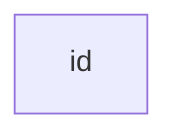

> **注意** id 是框中显示的内容。

**带文本的节点**

也可以在不同于 id 的框中设置文本。 如果多次这样做，它将是为将使用的节点找到的最后一个文本。 此外，如果您稍后为节点定义边，则可以省略文本定义。 渲染框时将使用先前定义的那个。

```
flowchart LR
    id1[这是框中的文字]
```


*六边形节点*

```
flowchart LR
    id1{{这是框中的文字}}
```


**图形**

该语句声明了流程图的方向。

这表明流程图从上到下（`TD` 或 `TB`）。

```
flowchart TD
    Start --> Stop
```

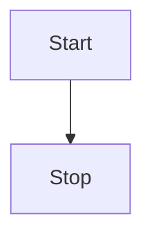

这表明流程图是从左到右 (`LR`) 方向的。


```
flowchart LR
    Start --> Stop
```

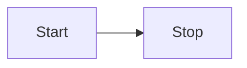

**流程方向**

可能的流程图方向是：

* TB - 从上到下
* TD - 自上而下/与自上而下相同
* BT - 从下到上
* RL - 右到左
* LR - 左到右

**节点形状**

*具有圆边的节点*

```
flowchart LR
    id1(这是方框里的文字)
```


*stadium-shaped 节点*

```
flowchart LR
    id1([这是方框里的文字])
```


*子程序形状中的节点*

```
flowchart LR
    id1[[这是方框里的文字]]
```

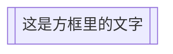

*圆柱形节点*

```
flowchart LR
    id1[(数据库)]
```

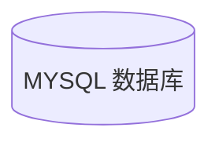


*圆形节点*

```
flowchart LR
    id1((这是圆圈里的文字))
```

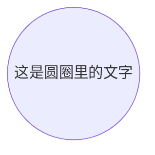

*不对称形状的节点*

```
flowchart LR
    id1>这是方框里的文字]
```


*一个节点（菱形）*

```
flowchart LR
    id1{这是方框里的文字}
```

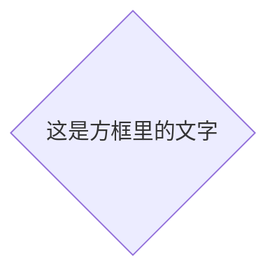

*六边形节点*

```
flowchart LR
    id1{{这是方框里的文字}}
```


*平行四边形*

```
flowchart TD
    id1[/这是方框里的文字/]
```

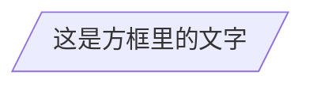

或

```
flowchart TD
    id1[\这是方框里的文字\]
```

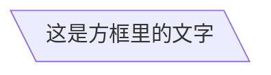

*梯形*

```
flowchart TD
    A[/春节\]
```

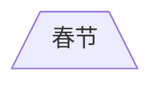

或

```
flowchart TD
    A[\去购物/]
```


*双圈*

```
flowchart TD
    id1(((这是圆圈里的文字)))

```

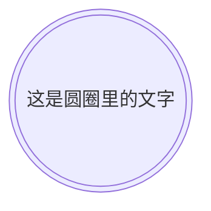

### 节点之间的连接

#### 带有箭头的连接

```
flowchart LR
    我-->公司
```

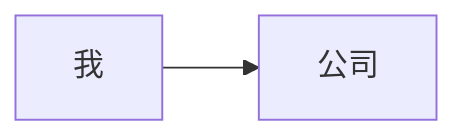

#### 开放的连接

```
flowchart LR
    我 --- 公司
```

```mermaid
flowchart LR
    我 --- 公司
```

#### 带文本连接

```
flowchart LR
    我-- 走路去 --->公司
```

```mermaid
flowchart LR
    我-- 走路--->公司
```
或

```
flowchart LR
    我---|走路|公司
```

```mermaid
flowchart LR
    我--->|走路|公司
```

#### 虚点连接

```
flowchart LR;
   我-.->商场;
```

```mermaid
flowchart LR;
   我-.->商场;
```

#### 带文本虚点连接

```
flowchart LR
   我-. 开车 .-> 商场
```

```mermaid
flowchart LR
   我-. 开车 .-> 商场
```

#### 粗线连接

```
flowchart LR
   我 ==> 商场
```

```mermaid
flowchart LR
   我 ==> 商场
```


## Sequence diagram(序列图)

```mermaid
sequenceDiagram
    participant Alice
    participant Bob
    Alice->>John: Hello John, how are you?
    loop Healthcheck
        John->>John: Fight against hypochondria
    end
    Note right of John: Rational thoughts <br/>prevail!
    John-->>Alice: Great!
    John->>Bob: How about you?
    Bob-->>John: Jolly good!
```

## Gantt diagram(甘特图)


```mermaid
gantt
dateFormat  YYYY-MM-DD
title Adding GANTT diagram to mermaid
excludes weekdays 2014-01-10

section A section
Completed task            :done,    des1, 2014-01-06,2014-01-08
Active task               :active,  des2, 2014-01-09, 3d
Future task               :         des3, after des2, 5d
Future task2               :         des4, after des3, 5d
```

## Class diagram(类图)

```mermaid
classDiagram
Class01 <|-- AveryLongClass : Cool
Class03 *-- Class04
Class05 o-- Class06
Class07 .. Class08
Class09 --> C2 : Where am i?
Class09 --* C3
Class09 --|> Class07
Class07 : equals()
Class07 : Object[] elementData
Class01 : size()
Class01 : int chimp
Class01 : int gorilla
Class08 <--> C2: Cool label
```

## Git graph

```mermaid
 gitGraph
       commit
       commit
       branch develop
       commit
       commit
       commit
       checkout main
       commit
       commit
```

